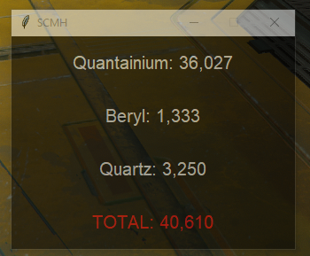

# Star Citizen Mining Helper



Was getting tired of pulling out the calculator everytime I am on a prospector to see if the bulk of rock in
front of me is worth my time so I made this

### THIS SOFTWARE COME AS IS - SO NO WARRANTIES

you're welcome

## Requirements

- Python 3.0+

Note: This is kind of obvious but since Star Citizen works only on Windows and we use some win32 api calls, 
no other OS than windows is supported at the moment

## Installation

Clone this repo and install the requirements (with virtualenv if possible)

On Windows CMD type:
```shell
python -m virtualenv -p python3 venv
.\venv\Scripts\activate
pip install -r requirements.txt
python main.py
```

## Good Luck

### neowinx out

#### o7